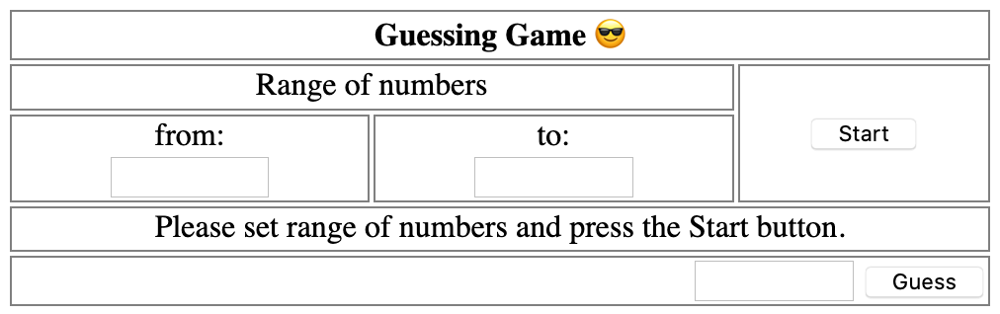

# Game - Guess the number

## Background & Objectives

The aim of this challenge is to create a game to guess the number.

## Specs

We need to provide a UI like the following where the player can specify:
 - the range for the random number
 - a button to start the game
 - an input field to type the guess
 - a help message to tell if the guessed number is smaller or greater than the number to guess
 - (optionally) an indicator of the number to tries already done 

Once the player guesses correctly he gets an alert congratulating him and indicating how many retires he needed. 

The end result could look like this: 

You can check the expected solution / play the game here [here](https://oussa.github.io/js-challenges/challenge3/solution/).
